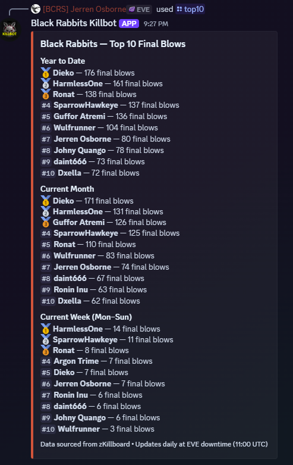
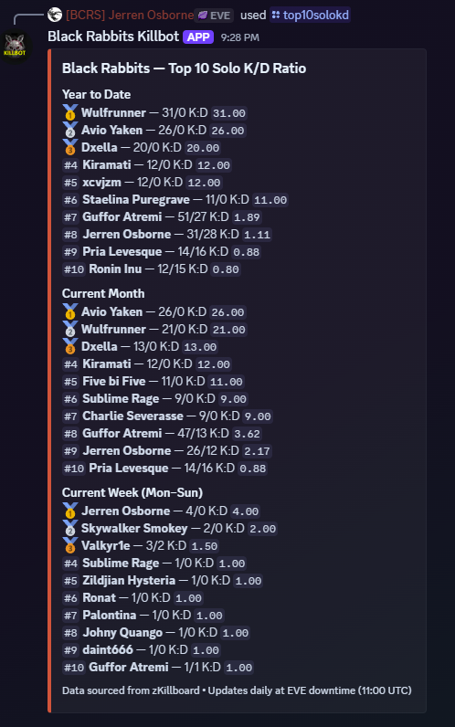
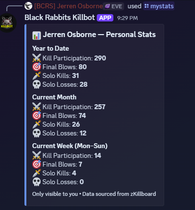

# Black Rabbits Killbot

A Discord bot for the **Black Rabbits** alliance in EVE Online that tracks kill and loss statistics and posts leaderboards to your Discord server.

## Features

- Top 10 pilots by final blows, solo kills, solo deaths, solo K/D, total damage, and kill participation
- Personal pilot stats card via `/mystats` — ephemeral, only visible to the requesting pilot
- Kill and loss tracking with full attacker/victim name resolution via ESI
- Background kill sync every **4 hours** — keeps data fresh around the clock
- Daily automated leaderboard post at **11:15 UTC** (after EVE downtime)
- Data sourced from zKillboard API + ESI (Alliance ID: 99012611)
- Local SQLite database — no external DB required

## Commands

| Command | Description |
|---|---|
| `/top10` | Top 10 pilots by final blows (YTD, Month, Week) |
| `/top10solo` | Top 10 pilots by solo final blows (YTD, Month, Week) |
| `/top10solodeaths` | Top 10 pilots by solo deaths (YTD, Month, Week) |
| `/top10solokd` | Top 10 pilots by solo K/D ratio (YTD, Month, Week) |
| `/topdamage` | Top 10 pilots by total damage dealt (YTD, Month, Week) |
| `/top10allkills` | Top 10 pilots by total kill participation (YTD, Month, Week) |
| `/mystats <pilot>` | Personal stats card — Kill Participation, Final Blows, Solo Kills, Solo Losses (ephemeral) |
| `/killsagainst <target>` | Top 10 BR pilots by kills against a specific pilot, corp, or alliance |
| `/info` | Bot info, commands, and update schedule |
| `/ping` | Confirms the bot is online |

## Architecture

| File | Purpose |
|---|---|
| `bot.py` | Discord client, scheduler, daily post logic |
| `commands.py` | All slash command definitions |
| `zkillboard.py` | zKillboard + ESI API fetching and kill/loss extraction |
| `database.py` | SQLite database init, save, and query helpers |
| `stats.py` | All leaderboard and pilot stat queries |
| `sync.py` | Standalone sync script (also called by scheduler) |
| `resolve_names.py` | Resolves character/corp/alliance IDs to names via ESI (runs after every sync) |

## Data Flow

- Every 4 hours: `sync_kills()` and `sync_losses()` fetch from zKillboard + ESI and store new records in `killboard.db`
- After each sync: `resolve_names.py` resolves any new character, corp, and alliance names from ESI
- Daily at 11:15 UTC: bot syncs, queries the DB, and posts the leaderboard embed to the configured channel

## Prerequisites
- Python 3.10 or higher
- SQLite3
- A Discord bot token

## Setup (Dev)

1. Clone the repo
2. Create a Python virtual environment: `python3 -m venv .venv`
3. Activate it: `source .venv/bin/activate`
4. Install dependencies: `pip install -r requirements.txt`
5. Copy `.env.example` to `.env.dev` and fill in your values
6. Run an initial sync: `python3 sync.py`
7. Start the bot: `python3 bot.py`

## Production Deployment

The bot runs as a systemd service (`br-killbot`) on Ubuntu pointing to `/opt/black-rabbits-killbot`.

```bash
# Check status
sudo systemctl status br-killbot

# Restart
sudo systemctl restart br-killbot

# View logs
sudo journalctl -u br-killbot -n 50 --no-pager

# Deploy a code update
sudo git -C /opt/black-rabbits-killbot pull origin main
sudo systemctl restart br-killbot

| Variable           | Description                                      |
| ------------------ | ------------------------------------------------ |
| DISCORD_TOKEN      | Your Discord bot token                           |
| DISCORD_GUILD_ID   | The Discord server (guild) ID                    |
| DISCORD_CHANNEL_ID | Channel ID for daily automated leaderboard posts |

## Example Screenshots







